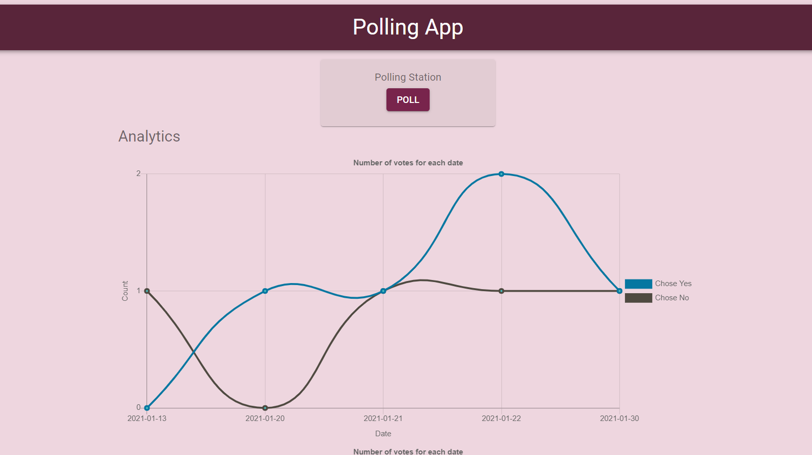
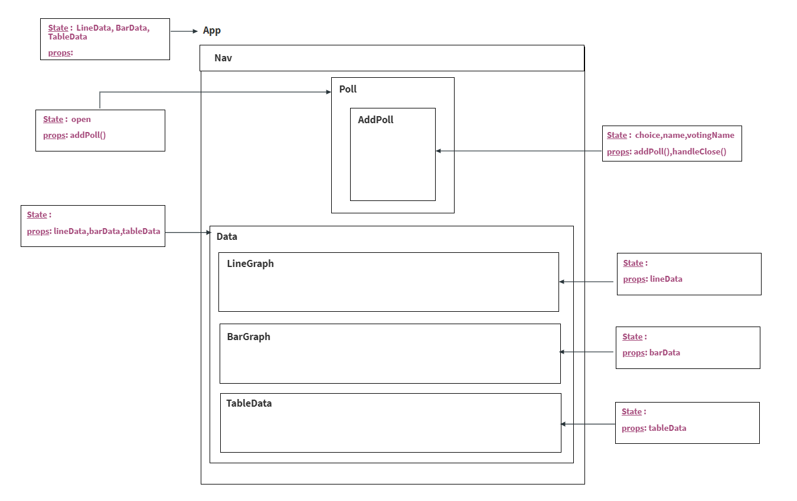

# Polling Application

A simple React Polling Application, where users are given few choices, can vote for one,and check the **trend** of the poll.

---

## Requirements

For development, you will require need Node.js and postgres installed in your system.

#### Node can be installed from : [NodeJS](https://nodejs.org/en/)
#### Postgresql can be installed from : [NodeJS](https://www.postgresql.org/)

---

## Libraries/Frameworks Used
1. [ReactJS](https://reactjs.org/) 
    * React was used to design the frontend of the project.
2. [ExpressJS](https://expressjs.com/)
    * Express is a Node.js web application framework that provides a robust set of features for web and mobile applications.Backend Routing in this project was done using express.
3. [node-postgres](https://www.npmjs.com/package/pg/)
    * PG a library that helps us with postgres operations.
4. [ChartJS](https://www.chartjs.org/)
    * ChartJS was used to display line charts and bar charts in our project.

---

## Before Installation, Do the following
    * Setup postgree
        1.Open Commend Prompt
        2.Login to postgres and create the database and the table:
                - psql -U postgres
                - Enter you password
                - CREATE DATABASE vote_database
                - CREATE TABLE votes(
                        ID SERIAL PRIMARY KEY,
                        voter_name VARCHAR(255) NOT NULL,
                        voting_choice Boolean NOT NULL,
                        casted_at VARCHAR(255) NOT NUll 
                    );
        NOTE: Postgre user,post,db can be configured in ./server/.env

## Installation
    * Server 
        -cd server
        -npm install

        NOTE : Don't change the server port (4000)
        
    * client
        -cd client
        -npm install
        -npm run build

## Running the App
    * Start the server
        -cd server
        -npm start
    * Start the react app
        - cd client
        - serve -s build -g 3000 (make sure serve is installed globally)
_Go to  [localhost](http://localhost:3000/)_

_yaay !!!_

---
## React component diagram

    

